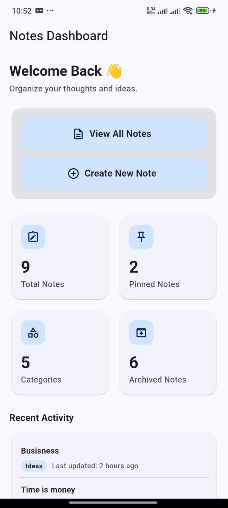
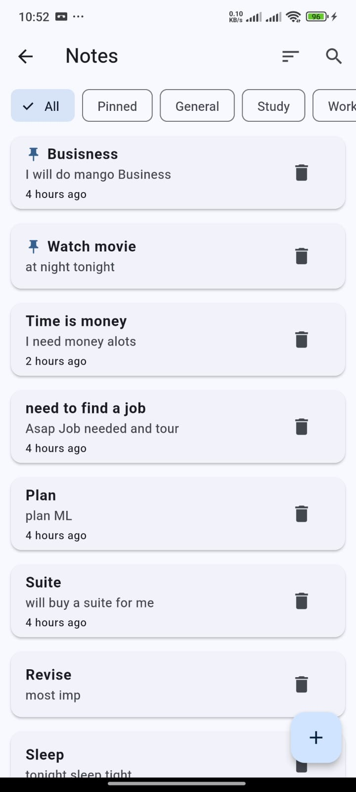
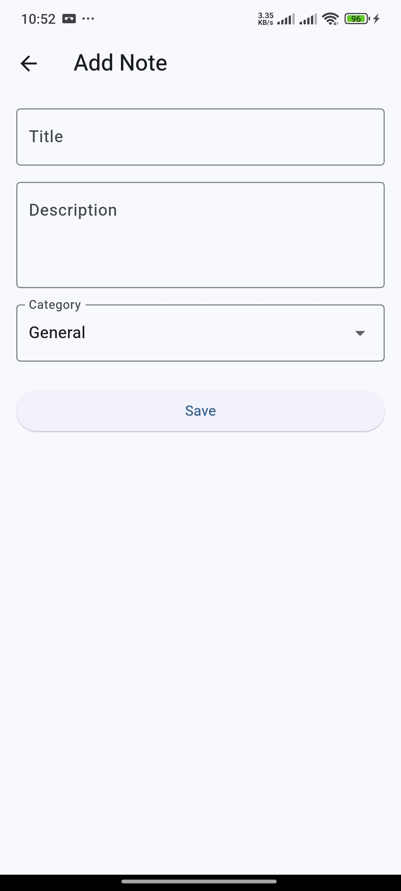
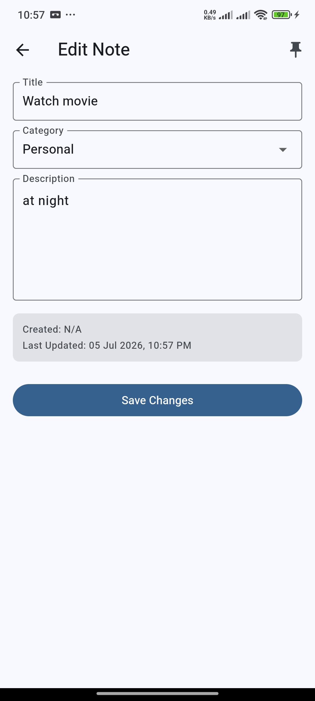
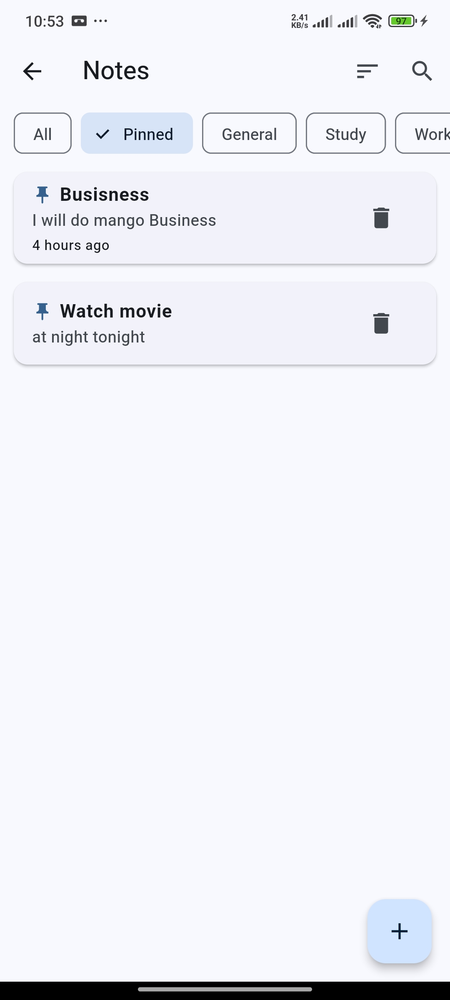
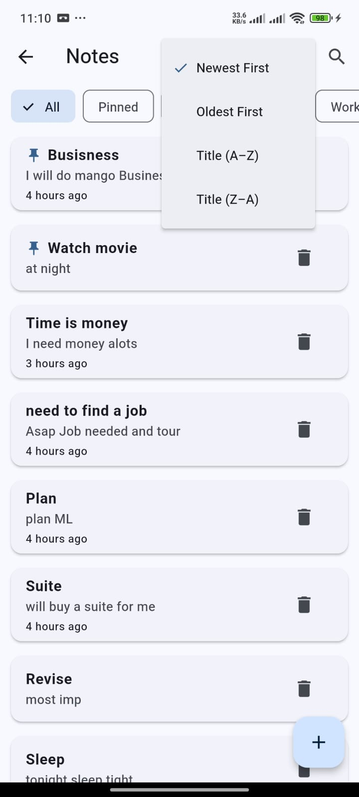
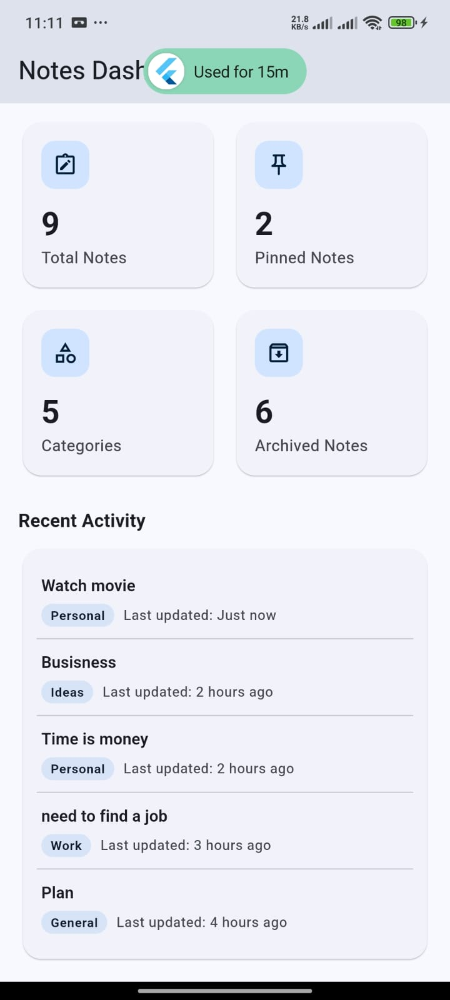

# 📝 Notes App

A modern Notes Management application built with **Flutter** and **Firebase Cloud Firestore**. The app allows users to create, organize, search, pin, update, and delete notes with a clean Material 3 interface.

---

## 📸 Screenshots

> **Note:** Screenshots will be added after the final UI is completed.

### 🏠 Home Dashboard

```text id="9o5xjt"
assets/screenshots/home_dashboard.png
```

<p align="center">
  
</p>

---

### 📋 Notes List

```text id="wvjlwm"
assets/screenshots/notes_list.png
```

<p align="center">
  
</p>

---

### 📄 Note Details

```text id="zjfgb0"
assets/screenshots/note_details.png
```

<p align="center">
  
</p>

---

### ➕ Add Note

```text id="7kysri"
assets/screenshots/add_note.png
```

<p align="center">
  
</p>

---

### ✏️ Edit Note

```text id="kjlwm4"
assets/screenshots/edit_note.png
```

<p align="center">
  
</p>

---

### 📌 Pinned Notes

```text id="djlwm8"
assets/screenshots/pinned_notes.png
```

<p align="center">
  
</p>

---

### 🔍 Search & Filters

```text id="wjlwm6"
assets/screenshots/search_filter.png
```

<p align="center">
  
</p>

---

### 📊 Dashboard Statistics

```text id="jlwm9x"
assets/screenshots/dashboard_statistics.png
```

<p align="center">
  
</p>

---

## ✨ Features

* Create, Read, Update and Delete notes
* Real-time synchronization with Cloud Firestore
* Pin important notes
* Categories and category filtering
* Search notes
* Sort notes
* Home Dashboard
* Note Details screen
* Material 3 UI
* Firebase server timestamps
* Responsive layout
